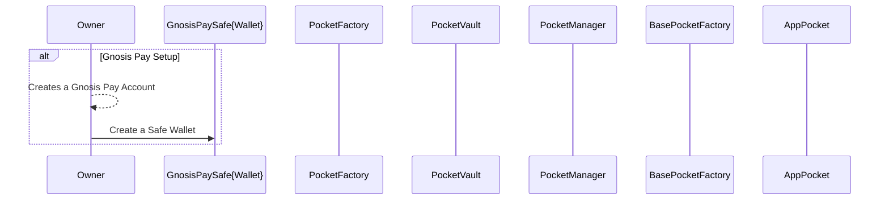
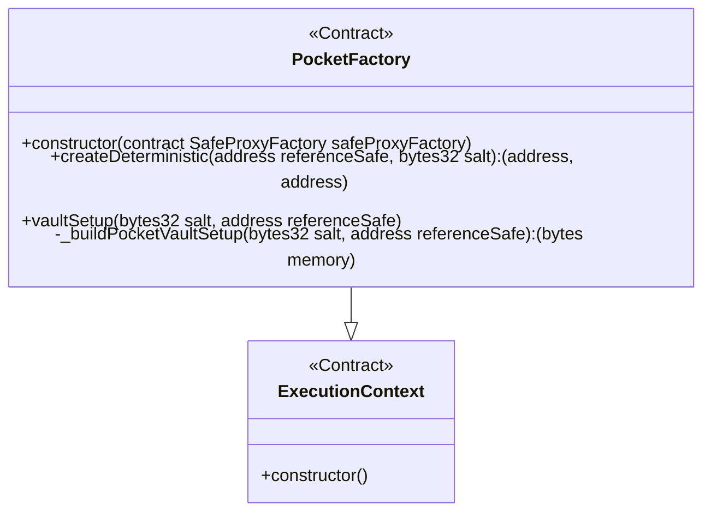
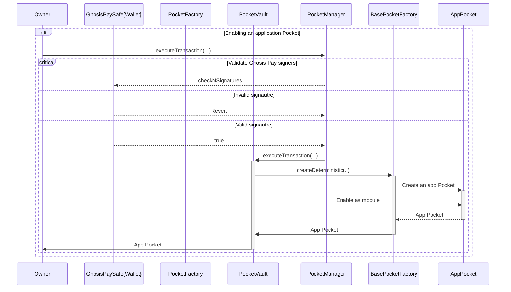
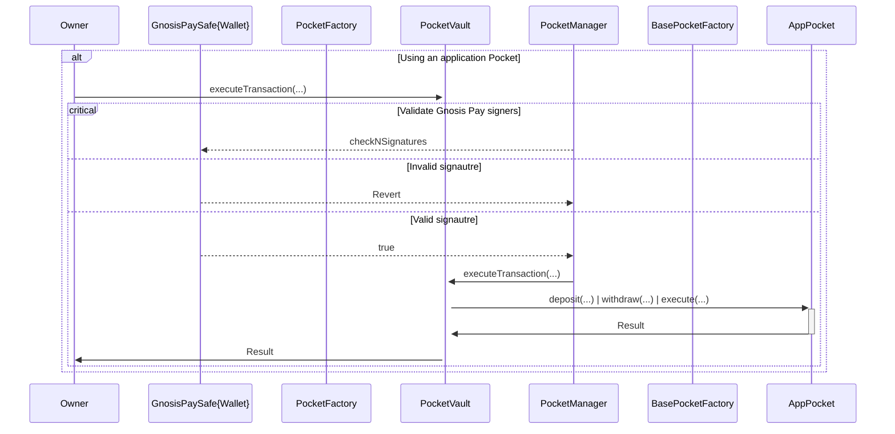
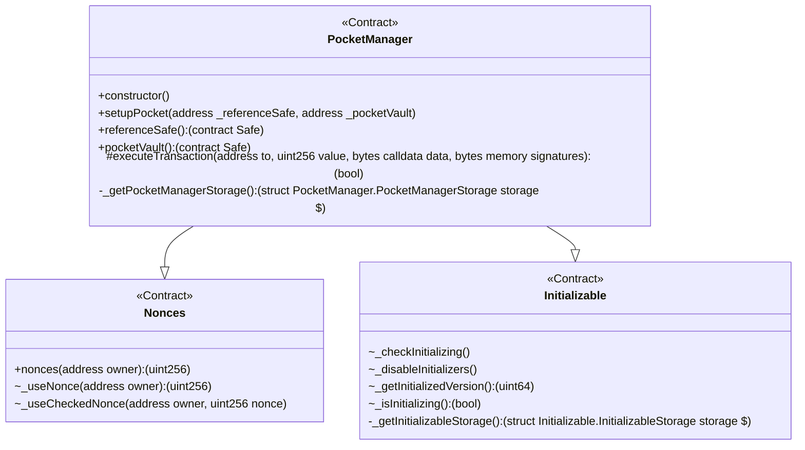
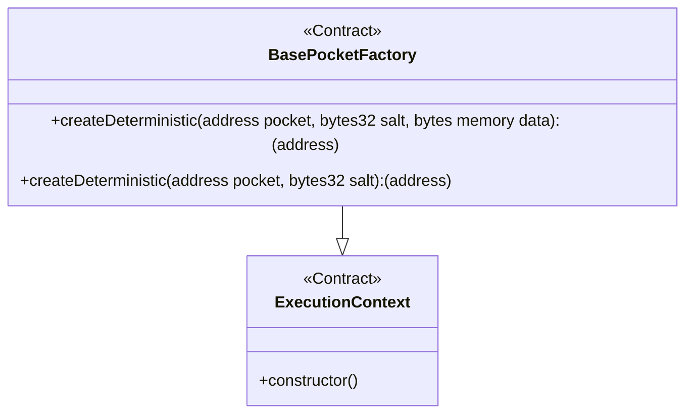
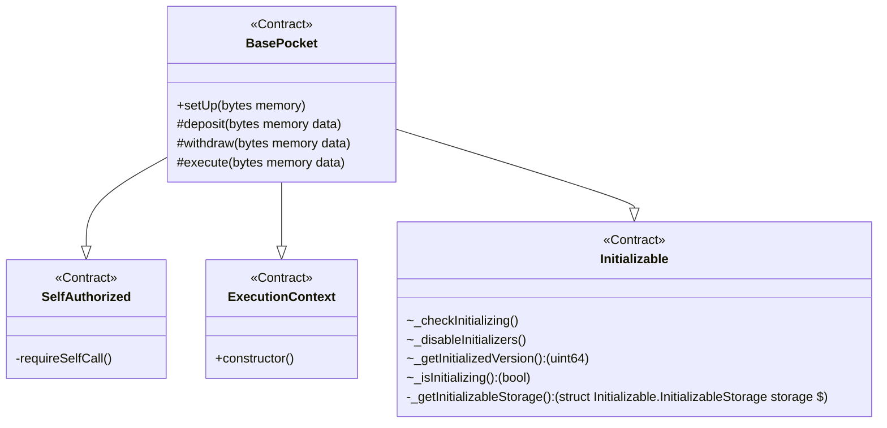

## Overview

Gnosis Pay is a non-custodial service that allows users to pay directly from their wallets using a Visa card. Gnosis Pay is built on top of Safe{Wallet} and includes a delay module that guarantees the merchants will have their funds available after a payment was made with the card.

However, this mechanism adds some limitations for the Safe, so it's not possible to operate the balances of the account without the delay module. This means that the Safe can't be used for other purposes while the delay module is active.

The goal of this project is to create an innovative mechanism to provide an secondary account that's seamless to operate and has the same security guarantees as the underlying Gnosis Pay Safe{Wallet}

### Goals

The smart contracts of the project are built with 2 main goals in mind:

- Allow a Gnosis Pay user to setup an account instantly.
- Standardize integrations for DeFi protocols and other services with the Gnosis Pay underlying wallet.

### Components

The smart contracts for the project are composed of 4 main components:

- PocketVault: A Safe{Wallet} with no owners that can only be operated through a [PocketManager](./packages/contracts/src/PocketManager.sol) module.
- [PocketManager](./packages/contracts/src/PocketManager.sol)): A module that allows the PocketVault to be operated by the same owners of a another Safe{Wallet}.
- [PocketFactory](.packages/contracts/src/PocketFactory.sol): A factory that allows the creation of a PocketVault and a PocketManager in a single transaction for a Safe{Wallet}. Ideally, this Safe{Wallet} is the Gnosis Pay's underlying one.
- Pockets: Pockets are a standard interface for DeFi protocols and other services to interact with the PocketVault. The base implementation for protocols to hook on Pocket is the [BasePocket](./packages/contracts/src/base/BasePocket.sol) contract.

### User Journey

#### Creating a Gnosis Pay Account

Users are expected to have already created a Gnosis Safe module and have a Safe{Wallet} with the delay module enabled. The user journey for creating a Gnosis Pay account is as follows:



#### Creating a PocketVault and a Pocket Manager

A user with a Gnosis Pay account should create a Pocket Vault for their Safe{Wallet} using the PocketFactory. Both are deployed in a single transaction, and the PocketManager is enabled as the owner module of the PocketVault. This one mirrors permissions from the Safe{Wallet}. The user journey for creating a PocketVault and a PocketManager is as follows:



#### Creating an application Pocket

Once a Gnosis Pay user has a PocketVault created, they can create an application Pocket. This Pocket is a standard interface for DeFi protocols and other services to interact with the PocketVault. The base implementation for protocols to hook on Pocket is the BasePocket contract and can be deployed through an BasePocketFactory

The user journey for creating an application Pocket is as follows:



### Interacting with an application Pocket

Each application Pocket has a standard interface for DeFi protocols and other services to interact with the PocketVault. The base implementation for protocols to hook on Pocket is the BasePocket contract.

```solidity
interface IBasePocket {
    function setUp(bytes memory) external; // Called by the BasePocketFactory
    function deposit(bytes memory) external; // For actions equivalent to a deposit (e.g. providing liquidity to a pool)
    function withdraw(bytes memory) external; // For actions equivalent to a withdraw (e.g. removing liquidity from a pool)
    function execute(bytes memory) external; // For actions that don't require a deposit or a withdraw (e.g. swapping tokens)
}
```

The user journey for interacting with an application Pocket is as follows:



### Architecture

#### PocketFactory


#### PocketVault

This is just a regular Safe{Wallet}.

#### PocketManager



#### BasePocketFactory



#### BasePocket


